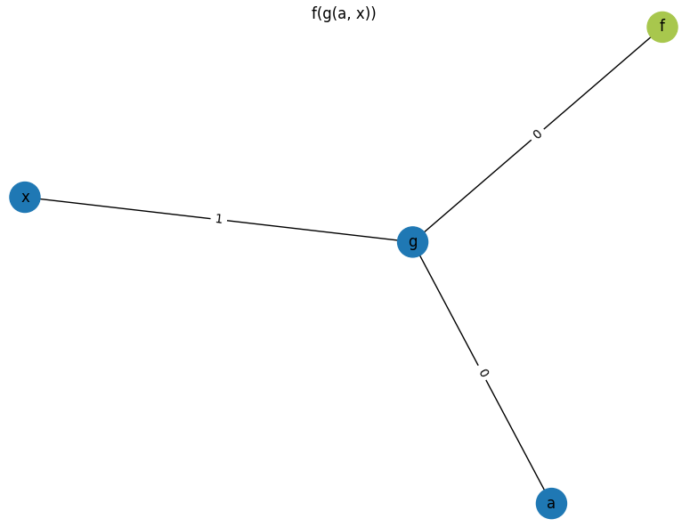

# Algebra Library

A free algebra library that contains the necessary components to encode an equation.

It also includes a way to print the equation or turn it into a directed acyclic graph (DAG)

## Classes Included

- Constant
- Variable
- Function
- FuncTerm
- Equation

To clean up type annotations, I defined a `Term` to mean any of the above.

A FuncTerm is an instantiation of a function with terms as its arguments.

An equation takes two terms and sets them equal to each other. 

## Directed Acyclic Graph (DAG)

A DAG can be created from a term. What it generates resembles a tree. The "top" will be a function (for a non-trivial term) and each function points to its arguments. The "leaves" would be a constant or a variable.

For example, take the term `f(g(x, a), g(x, a))`

The function `f` has two arguments, both of which is `g(x,a)`. Therefore, `f` points to `g`.  Since both the arguments are `g(x,a)`, we just have one node `g` that points to `x` and `a`.